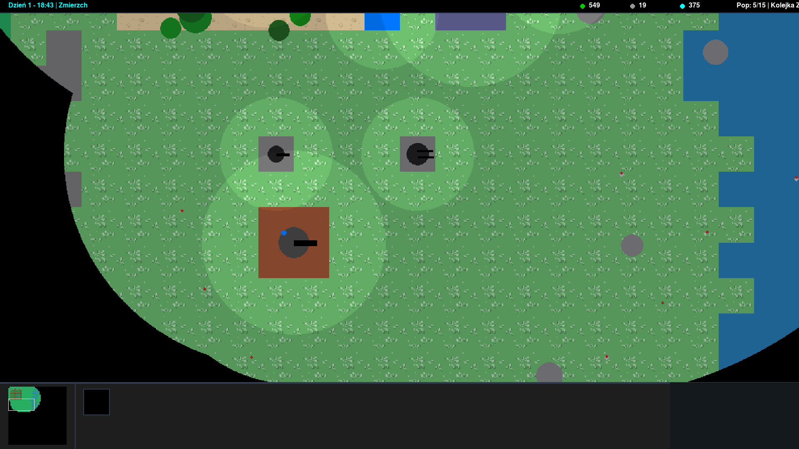
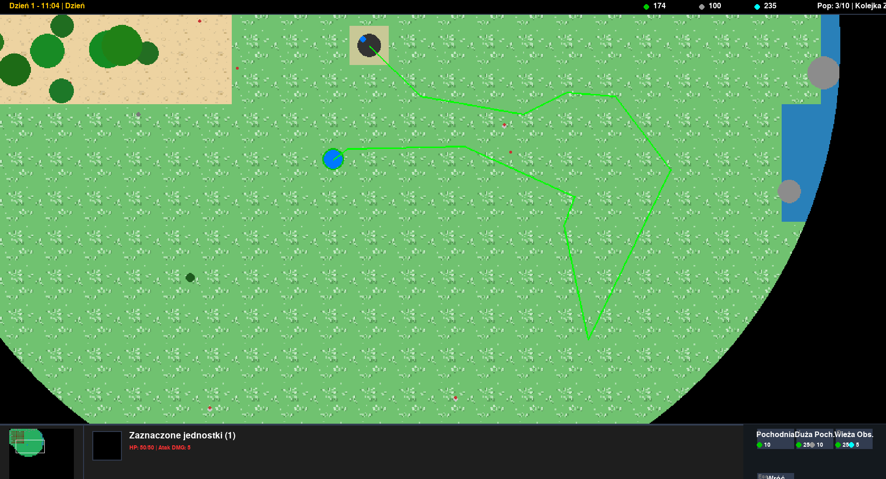
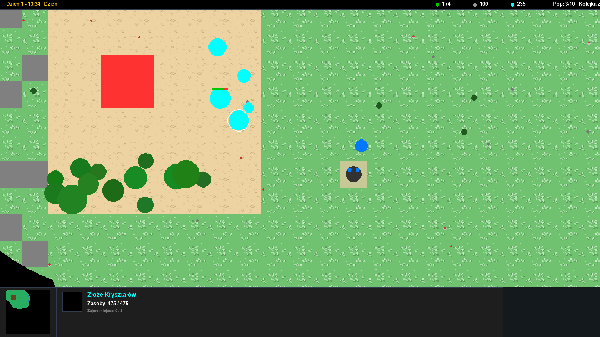

# RTS 2D Engine (Pygame-CE)

Zaawansowany silnik gry RTS (Real-Time Strategy) 2D zaimplementowany w języku Python z użyciem biblioteki `pygame-ce`. Projekt opiera się na architekturze modułowej oraz paradygmacie Data-Driven Design, co ułatwia testowanie balansu i szybką iterację.

## 🎥 Prezentacja Mechanik (Showcase)

### Cykl Dobowy i Dynamiczne Oświetlenie

*Zastosowanie techniki Subtractive Alpha Blending (`BLEND_RGBA_SUB`) do płynnego wycinania mroku wokół pracujących jednostek i pochodni, z zachowaniem warstwy True Fog of War.*

### Kinematyka Pocisków i Balistyka Artylerii

*Asynchroniczny ostrzał z garnizonów wieloosobowych, wbudowany rozrzut (inaccuracy) oraz balistyczna trajektoria lotu pocisków moździerzowych z obrażeniami obszarowymi (AoE).*

### Kolejkowanie Zadań (Shift-Queue) i Relaksacja Kolizji

*Wizualizacja wektorów ruchu dla zakolejkowanych komend (FSM). Widoczny system Soft-Collisions (Jitter-Fix) zapobiegający blokowaniu się jednostek oraz anty-stakowanie (Anti-Hugging) dla roju zombie.*

### Kaskadowy Interfejs Użytkownika (UI SC2 Style)

*Prawostronny panel dowodzenia z zagnieżdżonymi podmenu (Zasoby, Obrona, Wizja) oraz globalnym systemem wliczania ukrytych jednostek do wskaźnika populacji.*

## 🏗 Architektura Projektu

Projekt został podzielony na 5 odseparowanych modułów [Baza Treningowa: Wzorzec architektoniczny Separation of Concerns]:

1. **`config.py`** – Centralna baza danych silnika. Zawiera definicje statystyk (`UNIT_STATS`, `BUILDING_STATS`), palety kolorów oraz mechanizm Asset Pipeline (`IMAGE_PATHS`) z wbudowanym systemem Fallback.
2. **`main.py`** – Główna pętla renderowania, integracja zdarzeń wejścia (Event Routing), blokada kursora pełnego ekranu i globalny zarządca cyklu dobowego z odliczaniem fal przeciwników.
3. **`entities.py`** – Rozbudowane definicje klas obiektów środowiskowych. Zintegrowana, zaawansowana Maszyna Stanów (FSM) z pamięcią wektorów i celów dla autonomicznych agentów.
4. **`pathfinding.py`** – System wyszukiwania ścieżek oparty na algorytmie A* (A-Star), rozszerzony o modyfikatory kosztów terenu i dyfuzję szumu dla wrogich jednostek.
5. **`editory.py`** – Zewnętrzne środowisko deweloperskie typu IMGUI do malowania map z aktywnym Auto-Tilingiem brzegów (Bitmasking) i zapisem parametrów do plików `.json`.

## ⚙️ Systemy Logiczne

* **Pamięć Kontekstowa Zadań:** Agent pozostawiony w trybie auto-harvest samodzielnie poszukuje wolnych złóż (Resource Slots). Zmiana kontekstu zmusza agenta do weryfikacji uszkodzeń lokalnych budowli przed powrotem do pracy.
* **Optymalizacja Frustum Culling:** Wszystkie grafiki (Sprites) i obiekty, w tym wrogowie, nie są renderowane i są wykluczane z części obliczeń iteracyjnych, jeśli znajdują się poza wyznaczoną sferą widoczności gracza.
* **Event Scheduling (Limitowanie Kolejki):** Globalny capping instancji zombie. Hordy nie są zrzucane na mapę jednocześnie, lecz zasilają bufor spawnera ograniczony asynchroniczną pętlą zrzutu. Zapobiega to dławieniu się interpretera Pythona.

## 🎮 Sterowanie Zaimplementowane

* **LPM:** Pojedyncze i grupowe zaznaczanie (Drag & Select). Interakcja z UI.
* **PPM:** Kontekstowa akcja (Smart Click). Maszyna stanów w locie weryfikuje cel (Złoże -> HARVEST, Wróg -> ATTACK, Uszkodzony budynek -> REPAIR, Otwarta wieża -> GARRISON, Teren -> MOVE).
* **Shift + PPM:** Kolejkowanie komend (wpisanie do stosu FIFO).
* **Esc / F10:** Reset kontekstu kursora, odznaczenie jednostek lub wywołanie Menu Pauzy.
* **F11:** Wymuszenie trybu Pełnoekranowego (Fullscreen) z przechwyceniem kursora (`pygame.event.set_grab`).

## 🚀 Kompilacja Projektu (.exe)

Architektura wspiera budowanie do zamkniętego pliku binarnego za pomocą narzędzia PyInstaller.

```bash
pip install pyinstaller
pyinstaller --noconsole --onefile main.py --add-data "config.py;." --add-data "entities.py;." --add-data "pathfinding.py;."